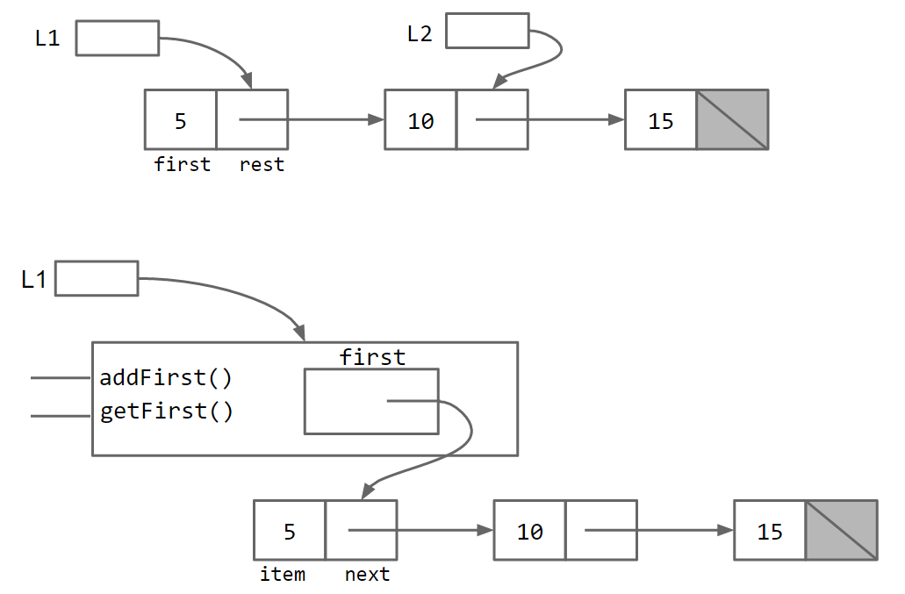
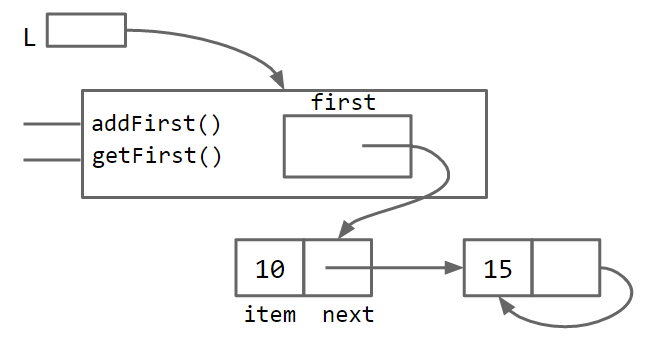
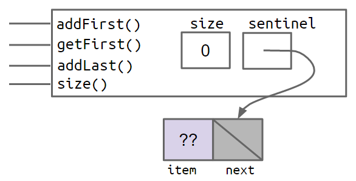

##SLLists

In Chapter 2.1, we built the `IntList` class, a list data structure that can technically do all the things a list can do. However, in practice, the `IntList` suffers from the fact that it is fairly awkward to use, resulting in code that is hard to read and maintain.

Fundamentally, the issue is that the `IntList` is what I call a **naked recursive** data structure. In order to use an `IntList` correctly, the programmer must understand and utilize recursion even for simple list related tasks. This limits its usefulness to novice programmers, and potentially introduces a whole new class of tricky errors that programmers might run into, depending on what sort of helper methods are provided by the `IntList` class.

Inspired by our experience with the `IntList`, we'll now build a new class `SLList`, which much more closely resembles the list implementations that programmers use in modern languages. We'll do so by iteratively adding a sequence of improvements.

###Improvement #1: Rebranding
https://youtu.be/1Rh3AdTxcik

Our `IntList` class from last time was as follows, with helper methods omitted:

```java
public class IntList {
	public int first;
	public IntList rest;
 
	public IntList(int f, IntList r) {
		first = f;
		rest = r;
	}
...```

Our first step will be to simply rename everything and throw away the helper methods. This probably doesn't seem like progress, but trust me, I'm a professional.

```java
public class IntNode {
	public int item;
	public IntNode next;
 
	public IntNode(int i, IntNode n) {
		item = i;
		next = n;
	}
}```

###Improvement #2: Bureaucracy

https://youtu.be/63GyeGDLAbw

Knowing that `IntNodes` are hard to work with, we're going to create a separate class called `SLList` that the user will interact with. The basic class is simply:

```java
public class SLList {
	public IntNode first;

	public SLList(int x) {
	first = new IntNode(x, null);
	}
}```

Already, we can get a vague sense of why a `SLList` is better. Compare the creation of an `IntList` of one item to the creation of a `SLList` of one item.

```java
IntList L1 = new IntList(5, null);
SLList L2  = new SLList(5);```

The `SLList` hides the detail that there exists a null link from the user. The `SLList` class isn't very useful yet, so let's add an `addFirst` and `getFirst` method as simple warmup methods. Consider trying to write them yourself before reading on.

###addFirst and getFirst

https://youtu.be/inV6cAEERRI

`addFirst` is relatively straightforward if you understood chapter 2.1. With `IntLists`, we added to the front with the line of code `L = new IntList(5, L)`. Thus, we end up with:

```java
public class SLList {
	public IntNode first;

	public SLList(int x) {
		first = new IntNode(x, null);
	}

	/** Adds an item to the front of the list. */
	public void addFirst(int x) {
		first = new IntNode(x, first);
	}
}```

`getFirst` is even easier. We simply return `first.item`:

```java
/** Retrieves the front item from the list. */
public int getFirst() {
	return first.item;
}```

The resulting `SLList` class is much easier to use. Compare:

```java
SLList L = new SLList(15);
L.addFirst(10);
L.addFirst(5);
int x = L.getFirst();```

to the `IntList` equivalent:

```java
IntList L = new IntList(15, null);
L = new IntList(10, L);
L = new IntList(5, L);
int x = L.first;```

Comparing the two data structures visually, we have:



Essentially, the `SLList` class acts as a middleman between the list user and the naked recursive data structure. As Ovid said: 
[Mortals cannot look upon a god without dying](https://en.wikipedia.org/wiki/Semele), so perhaps it is best that the `SLList` is there to act as our intermediary.

**Exercise 2.2.1**: The curious reader might object and say that the `IntList` would be just as easy to use if we simply wrote an `addFirst` method. Try to write an `addFirst` method to the `IntList` class. You'll find that the resulting method is tricky as well as inefficient.

###Improvement #3: Public vs. Private

https://youtu.be/SlCnrzn_bfM

Unfortunately, our `SLList` can be bypassed and the raw power of our naked data structure (with all its dangers) can be accessed. A programmer can easily modify the list directly, without going through the kid-tested, mother-approved `addFirst` method, for example:

```java
SLList L = new SLList(15);
L.addFirst(10);
L.first.next.next = L.first.next;```



This results in a malformed list with an infinite loop. To deal with this problem, we can modify the `SLList` class so that the `first` variable is declared with the `private` keyword.

```java
public class SLList {
	private IntNode first;
...```

Private variables and methods can only be accessed by code inside the same `.java` file, e.g. in this case `SLList.java`. That means that a class like `SLLTroubleMaker` below will fail to compile, yielding a `first has private access in SLList` error.

```java
public class SLLTroubleMaker {
	public static void main(String[] args) {
		SLList L = new SLList(15);
		L.addFirst(10);
		L.first.next.next = L.first.next;
	}
}```

By contrast, any code inside the `SLList.java` file will be able to access the `first` variable. 

It may seem a little silly to restrict access. After all, the only thing that the `private` keyword does is break programs that otherwise compile. However, in large software engineering projects, the `private` keyword is an invaluable signal that certain pieces of code should be ignored (and thus need not be understood) by the end user. Likewise, the `public` keyword should be thought of as a declaration that a method is available and will work **forever** exactly as it does now.

As an analogy, a car has certain `public` features, e.g. the accelerator and brake pedals. Under the hood, there are `private` details about how these operate. In a gas powered car, the accelerator pedal might control some sort of fuel injection system, and in a battery powered car, it may adjust the amount of battery power being delivered to the motor. While the private details may vary from car to car, we expect the same behavior from all accelerator pedals. Changing these would cause great consternation from users, and quite possibly terrible accidents.

**When you create a `public` member (i.e. method or variable), be careful, because you're effectively committing to supporting that member's behavior exactly as it is now, forever.**

###Improvement #4: Nested Classes

At the moment, we have two `.java` files: `IntNode` and `SLList`. However, the `IntNode` is really just a supporting character in the story of `SLList`. 

Java provides us with the ability to embed a class declaration inside of another for just this situation. The syntax is straightforward and intuitive:

```java
public class SLList {
   	public class IntNode {
			public int item;
			public IntNode next;
			public IntNode(int i, IntNode n) {
				item = i;
				next = n;
			}
   	}

   	private IntNode first; 

   	public SLList(int x) {
   		first = new IntNode(x, null);
   	} 
   	...```

Having a nested class has no meaningful effect on code performance, and is simply a tool for keeping code organized. For more on nested classes, see [Oracle's official documentation](https://docs.oracle.com/javase/tutorial/java/javaOO/nested.html).

If the nested class has no need to use any of the instance methods or variables of `SLList`, you may declare the nested class `static`, as follows. Declaring a nested class as `static` means that methods inside the static class can not access any of the members of the enclosing class. In this case, it means that no method in `IntNode` would be able to access `first`, `addFirst`, or `getFirst`.

```java
public class SLList {
   	public static class IntNode {
			public int item;
			public IntNode next;
			public IntNode(int i, IntNode n) {
				item = i;
				next = n;
			}
   	}

   	private IntNode first;
   	...```

This saves a bit of memory, because each `IntNode` no longer needs to keep track of how to access its enclosing `SLList`. 

Put another way, if you examine the code above, you'll see that the `IntNode` class never uses the `first` variable of `SLList`, nor any of `SLList`'s methods. As a result, we can use the static keyword, which means the `IntNode` class doesn't get a reference to its boss, saving us a small amount of memory.

If this seems a bit technical and hard to follow, try Exercise 2.2.2. A simple rule of thumb is that *if you don't use any instance members of the outer class, make the nested class static*.

**Exercise 2.2.2** Delete the word `static` as few times as possible so that [this program](exercises/Government.java) compiles. Make sure to read the comments at the top before doing the exercise.

###addLast() and size()

https://youtu.be/Gxq_LSsOPNc

To motivate our remaining improvements and also demonstrate some common patterns in data structure implementation, we'll add `addLast(int x)` and `size()` methods. You're encouraged to take the [starter code](https://github.com/Berkeley-CS61B/lectureCode/blob/master/lists2/DIY/addLastAndSize/SLList.java) and try it yourself before reading on. I especially encourage you to try to write a recursive implementation of `size`, which will yield an interesting challenge.

I'll implement the `addLast` method iteratively, though you could also do it recursively. The idea is fairly straightforward, we create a pointer variable `p` and have it iterate through the list to the end.

```java
/** Adds an item to the end of the list. */
public void addLast(int x) {
	IntNode p = first;

	/* Advance p to the end of the list. */
	while (p.next != null) {
		p = p.next;
	}
	p.next = new IntNode(x, null);
}```

By contrast, I'll implement `size` recursively. This method will be somewhat similar to the `size` method we implemented in section [2.1](https://joshhug.gitbooks.io//obscurantism-in-java-first-edition/content/chap2/chap21.html) for `IntList`. 

The recursive call for `size` in `IntList` was straightforward: `return 1 + this.rest.size()`. For a `SLList`, this approach does not make sense. A `SLList` has no `rest` variable. Instead, we'll use a common pattern that is used with middleman classes like `SLList` -- we'll create a private helper method that interacts with the underlying naked recursive data structure.

This yields a method like the following:

```java
/** Returns the size of the list starting at IntNode p. */
private static int size(IntNode p) {
	if (p.next == null) {
		return 1;
	}

	return 1 + size(p.next);
}```

Using this method, we can easily compute the size of the entire list:

```java
public int size() {
	return size(first);
}```

Here, we have two methods, both named `size`. This is allowed in Java, since they have different parameters. We say that two methods with the same name but different signatures are **overloaded**. For more on overloaded methods, see Java's [official documentation](https://docs.oracle.com/javase/tutorial/java/javaOO/methods.html).

An alternate approach is to create a non-static helper method in the `IntNode` class itself. Either approach is fine, though I personally prefer not having any methods in the `IntNode` class.

#Improvement #5: Caching

https://youtu.be/ebUw8fhhpKc

Consider the `size` method we wrote above. Suppose `size` takes 2 seconds on a list of size 1,000. We expect that on a list of size 1,000,000, the `size` method will take 2,000 seconds, since the computer has to step through 1,000 times as many items in the list to reach the end. Having a `size` method that is very slow for large lists is unacceptable, since we can do better.

It is possible to rewrite `size` so that it takes the same amount of time, no matter how large the list.

To do so, we can simply add a `size` variable to the `SLList` class that tracks the current size, yielding the code below. This practice of saving important data to speed up retrieval is sometimes known as **caching**.

```java
public class SLList {
	... /* IntNode declaration omitted. */
	private IntNode first;
	private int size;

	public SLList(int x) {
		first = new IntNode(x, null);
		size = 1;
	}

	public void addFirst(int x) {
		first = new IntNode(x, first);
		size += 1;
	}

	public int size() {
		return size;
	}
	...
}```

This modification makes our `size` method incredibly fast, no matter how large the list. Of course, it will also slow down our `addFirst` and `addLast` methods, and also increase the memory of usage of our class, but only by a trivial amount. In this case, the tradeoff is clearly in favor of creating a cache for size.

###Improvement #6: The Empty List

https://youtu.be/GaOL52PuYcw

Our `SLList` has a number of benefits over the simple `IntList` from chapter 2.1:
 - Users of a `SLList` never see the `IntList` class.
   - Simpler to use.
   - More efficient `addFirst` method (exercise 2.2.1).
   - Avoids errors or malfeasance by `IntList` users.
 - Faster `size` method than possible with `IntList`.

Another natural advantage is that we will be able to easily implement a constructor that creates an empty list. The most natural way is to set `first` to `null` if the list is empty. This yields the constructor below:

```java
public SLList() {
	first = null;
	size = 0;
}```

Unfortunately, this causes our `addLast` method to crash if we insert into an empty list. Since `first` is `null`, the attempt to access `p.next` in `while (p.next != null)` below causes a null pointer exception.

```java
public void addLast(int x) {
	size += 1;
	IntNode p = first;
	while (p.next != null) {
		p = p.next;
	}
 
	p.next = new IntNode(x, null);
}```

Exercise 2.2.2: Fix the `addLast` method. Starter code [here](https://github.com/Berkeley-CS61B/lectureCode/blob/master/lists2/DIY/fixAddLast/SLList.java).

###Improvement #6b: Sentinel Nodes

https://youtu.be/HafzSAm3DPE

One solution to fix `addLast` is to create a special case for the empty list, as shown below:

```java
public void addLast(int x) {
	size += 1;

	if (first == null) {
	first = new IntNode(x, null);
		return;
	}
 
	IntNode p = first;
	while (p.next != null) {
		p = p.next;
	}
 
	p.next = new IntNode(x, null);
}```

This solution works, but special case code like that shown above should be avoided when necessary. Human beings only have so much working memory, and thus we want to keep complexity under control wherever possible. For a simple data structure like the `SLList`, the number of special cases is small. More complicated data structures like trees can get much, much uglier.

A cleaner, though less obvious solution, is to make it so that all `SLLists` are the "same", even if they are empty. We can do this by creating a special node that is always there, which we will call a **sentinel node**. The sentinel node will hold a value, which we won't care about.

For example, the empty list created by `SLList L = new SLList()` would be as shown below:



And a `SLList` with the items 5, 10, and 15 would look like:


In the figures above, the lavender ?? value indicates that we don't care what value is there. Since Java does not allow us to fill in an integer with question marks, we just pick some abitrary value like -518273 or 63 or anything else.

Since a `SLList` without a sentinel has no special cases, we can simply delete the special case from our `addLast` method, yielding:

```java
public void addLast(int x) {
	size += 1;
	IntNode p = sentinel;
	while (p.next != null) {
		p = p.next;
	}
 
	p.next = new IntNode(x, null);
}```

As you can see, this code is much much cleaner!

###Invariants

https://youtu.be/Y8i0MpxC2yE

An invariant is a fact about a data structure that is guaranteed to be true (assuming there are no bugs in your code).

A `SLList` with a sentinel node has at least the following invariants:
 - The `sentinel` reference always points to a sentinel node.
 - The front item (if it exists), is always at `sentinel.next.item`.
  - The `size` variable is always the total number of items that have been added.

Invariants make it easier to reason about code, and also give you specific goals to strive for in making sure your code works.

A true understanding of how convenient sentinels are will require you to really dig in and do some implementation of your own. You'll get plenty of practice in project 1. However, I recommend that you wait until after you've finished the next section of this book before beginning project 1.

####What Next

Nothing for this chapter. However, if you're taking the Berkeley course, you're welcome to now begin Lab 2.